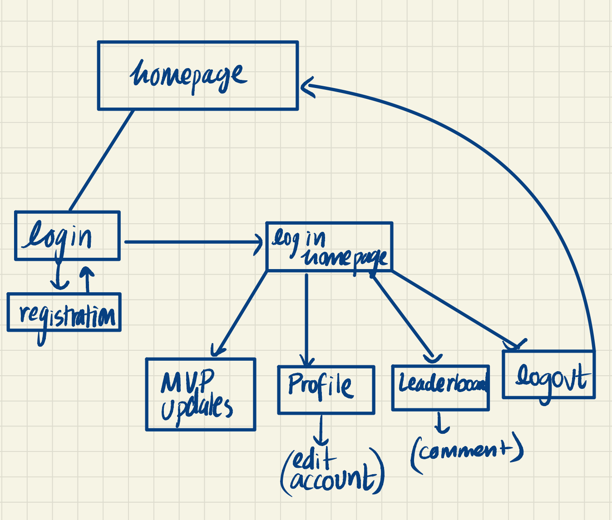
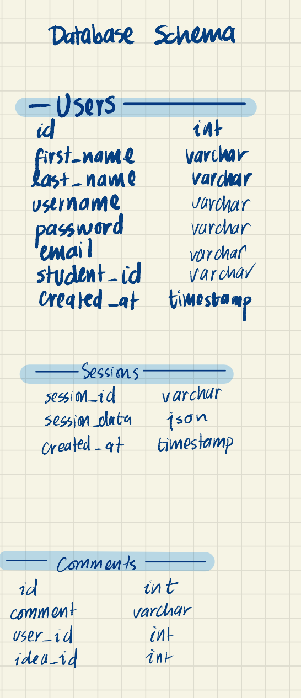

# Final Boss Challenge
Akanksha Pandey, A16489437
## Challenges: 
It took me a while to understand the sessions code provided in class, and the sheer scale of this project intimidated me amidst finals and week 10 deadlines. However, I pushed through once I set my mind to it and once I went to office hours to resolve the bug in the sessions code. 

## Paths 
Path formatting is correct. 

## Video Link 
[Zoom Video](https://ucsd.zoom.us/rec/play/P2e8IsDRaWlJnJHXpSkKfpLCQfZouA8bcB3r1lWU5kdjSeGBE7oK9vG2kiOXlP_11JATlNP8WcTtbVY9.9s455jp0uAopgOBS?autoplay=true&continueMode=true&startTime=1679639725000)
 
Passcode: $$Y0SR%=
 
(It might make you sign up with a UCSD Account.)

## System Design 

## DB Schema 

## Information Architecture 

## REST Routes

trying to publish the branch 
